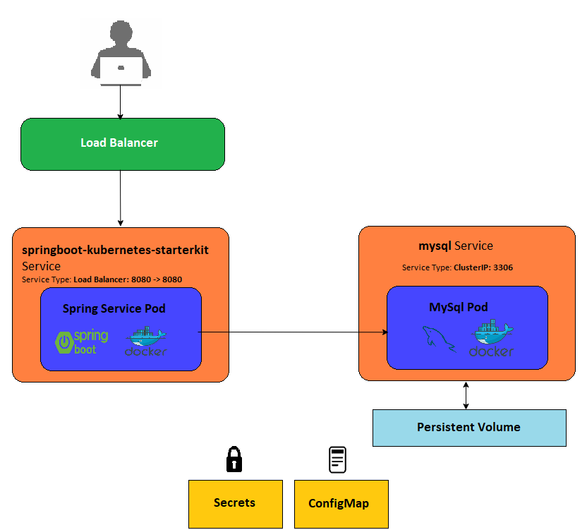

<h1 align="center">
   
  <a>
   
  springboot-kubernetes-starterkit
   
</h1>
In this project I'm demonstrating the most interesting features of Kubernetes with Spring Boot for building two tier architecture that is deployed on Kubernetes. All the samples may be easily deployed on local Kubernetes single-node cluster.
  
## Getting Started  
Here you will find a simple spring boot application with a simple model and we will be covering implementation and deployment using Kurbernetes, To know more about Kubernetes, You cover inside the my [Hello-k8s](https://github.com/exceptionalcode/hello-k8s) Kubernetes learning kit.
Here in this starter kit you will be introduced to list below :
* A simple spring boot application with a basic model structure performing a CRUD operation. The example is available in the branch master.
* An introduction to Kubernetes with spring boot project, that shows its the most interesting features like Spring Boot, MySql property sources based on ConfigMap and Secret. 
* Using Spring Boot to monitor Spring Boot applications running on Kubernetes using external endpoint exposed by load balancer. 

### Prerequisite
Installed: [Docker](https://www.docker.com/), [Java 1.8](https://www.oracle.com/technetwork/java/javase/overview/index.html), [Maven 3.x](https://maven.apache.org/install.html), [Git](https://www.digitalocean.com/community/tutorials/how-to-contribute-to-open-source-getting-started-with-git)\
For Kubernetes you can use simple [Docker for Desktop](https://www.docker.com/products/docker-desktop) in local machine , here you can enable Kubernetes service.

### Usage
* Clone [springboot-kubernetes-starterkit](https://github.com/exceptionalcode/springboot-kubernetes-starterkit.git)
* Download and Start Docker and Kubernetes services
* Build Maven project with using command: mvn clean install
* Build Docker images for each module using command, for example: docker build -t ishaansolanki6/springbootk8s:0.0.1 .
  
## Architecture
Our sample springboot-k8s based application system  consists of the following components:

* **Springboot-service** - A springboot app that allows to perform CRUD operation on JPA Repository of technology.
* **Mysql-service** - It is a mysql server hosted inside the pod that only allows to connect springbooot application for CRUD operations.
* **Persistent Volume** - A Persistent Volume Claim(PVC) which is responsible to store all the data and transaction made by the app, This volume can be mounted back even application is lost.
* **Secrets** - Secrets let you store and manage sensitive information, such as mysql password,username and host in encrypted format.
* **ConfigMap** - A ConfigMap is an API object used to store non-confidential data in key-value pairs such as mysql table info and data.
* **LoadBalancer** - It is a service responsible to route traffic or access your application from external world.
 
 
 ## Deploy and Run
 
 * Go to k8s-mysql folder and apply all the files using ccommand : $ kubectl apply -f <filename>.yaml
 * To check if the manifest resources are created : $ kubectl get pods , $ kubectl get svc , $ kubectl get deploy.
 * Do same with k8-springboot apply all the files using above command.
 
 ** To check application is ruuning ** 
 
 
 
